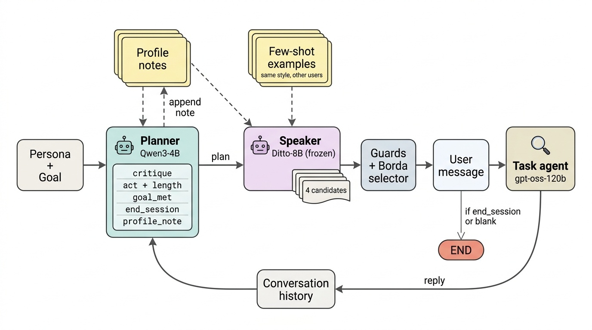

# 草稿（中文版）— Introduction、Related Work、Methodology 與 Future Work（rev. 5）

> 這是英文稿 `Draft.md` rev.5 的中文對照，內容逐段對應（含作者註），供確認內容用。
> `> 註` 是給作者的說明，定稿時刪除；所有數字與文獻都出自文末「來源」，文獻缺的欄位標 `TODO`。
> 版面：模板是 2 頁 extended abstract（Intro 約 250 words、沒有 Related Work 節）。本稿（rev.5）Intro 約 950 words、Related Work 約 570 words、Methodology 約 850 words、Future Work 約 800 words（皆不含作者註），
> 放進模板時：Intro 刪到 背景 2 句／缺口 3 句／做法 2 句；Related Work 併成 Intro 裡約 80 words 的一段（見 §2 末的濃縮版）。

---

## 1. 引言（Introduction）

**背景。** 使用者模擬器越來越常被用來評估與訓練對話式資訊存取系統 [Balog & Zhai 2024]。TREC 2026 User Simulation Track 的場景是「對話式資料集搜尋」：一位研究者透過搜尋介面尋找合適的資料集 [Kreutz et al. 2025]。模擬器要嘛在給定部分對話歷史與使用者資訊需求下預測使用者的下一句話（Task 1），要嘛生成整段對話，並且自己決定何時目標已滿足、或何時放棄（Task 2）。賽道會將 query 長度、對話輪數、澄清請求的分佈與真實紀錄比較，並搭配人類 Turing test。

**缺口。** 我們稱一個模擬器具有「整段對話層級的保真度」（session-level faithful），是指它每一輪「是否結束」的決定與真人一致——重點是**何時**結束，而不只是**會不會**結束——從而它的對話長度分佈也與真人一致。近年的 LLM 模擬器在單輪保真度（意圖遵循、persona 一致性、風格）上已相當強 [Naous et al. 2026；Abdulhai et al. 2025；Wang et al. 2025]，但在本賽道資料上，這並不會延伸到整段對話層級。在我們實驗室的內部 benchmark（不是官方評估）中，一個 Turing-RL 配方的重現版 [Wang et al. 2026a]——其 act 轉移落在真人雜訊地板以內，act 分佈則與另一個系統並列 benchmark 中最接近真人（act TVD 0.185）——在重播完整真人對話後再給它一輪時**從不結束**（0/26 個 session），平均跑 9.9 輪，而真人平均 4.4 輪；公開的 UserLM-8b [Naous et al. 2026] 以其原生 end token 提示時，則在 72% 的「真人其實還繼續」的中間輪輸出 END，對話平均只有 1.04 輪；zero-shot 的 Ditto-8B 則接近真人平均（5.0 輪）。可見 act 層級保真度無法預測整段對話行為：act 分佈最接近真人的兩個模擬器之一從不結束，而離真人較遠的 Ditto-8B（act TVD 0.305）對話長度卻接近真人。結束行為也對探針設定很敏感：新版探針加入一條共用的結束指示（同時更新了 system agent 設定），就讓 Ditto-8B 的 K+1 end rate 從 0.04 變成 0.48。現有模擬器的 RL reward 不是逐句判斷，就是（USP 的）單一個對話層級 profile 相似度分數；沒有任何一個拿模擬器的對話長度或結束位置去和真人比較——我們先以設計處理這個缺口（§3），再嘗試以訓練補上它（§4）。

**我們的做法。** 我們建構一個 Planner–Speaker 模擬器，其中「結束對話」是 Planner（Qwen3-4B-Instruct-2507）一個獨立且具約束力的決策，由 Planner 自己判斷使用者的目標是否已達成；凍結的 Speaker（Ditto-8B，它沒有結束對話的 token；依 benchmark 慣例，Speaker 輸出空白也會結束 episode）根據計畫、Planner 在對話中累積的「這位使用者怎麼寫」的隱含 profile，以及寫作風格相同的其他使用者的真實訊息，寫出候選訊息，再由「長度＋風格」selector 挑出一則（Figure 1）。這個設計先前的兩個免訓練版本說明了為什麼「結束」需要一個明確且具約束力的決策。第一版中，Speaker 無視 Planner 的結束決定（被要求收尾時只有 8% 真的收尾），64 段中有 51 段撞到 10 輪上限。第二版在多項改動中包括讓 Planner 的決定具約束力，於是能夠收尾（K+1 end rate 0.05 → 0.48，對照的是去掉 annotations 的第一版），但結束得太早（premature end rate 0.03 → 0.14）。目前的設計拿掉了規則式的結束帳本，改由 Planner 自己的 `goal_met`／`still_wanted` 判斷決定，並加入隱含 profile、風格相符的範例與 Borda selector；這些改動是否比第二版更好，尚未在相同協定下量測。我們也嘗試用強化學習（以整段對話層級 reward 的 GRPO）學習結束時機；在未見過的對話上它沒有比未訓練的 Planner 更好，我們在 §4 報告遇到的難關。

> 註：Findings 目前只有 fold 2 的 test（Task 2：5 段對話 × 8 seeds；Task 1：9 段對話），fold 0/1 還沒跑；與前一版（E1.6）在同一協定下的比較也還沒做（AUDIT_SPEC 的比較協定）。若要與 benchmark 其他方法同表，須先證明我們 Task 2 環境（自架 R0／ledger judge）與 benchmark 的 system agent 設定（prompt v4、length_retry_v1）一致。數字來源：`runs/pend_f2_v16/test_boot.txt`（u0 列；TEST CHECK PASSED、verify passed，2026-09-29 00:33）。

**主要發現。** 在一個 fold（fold 2：Task 2 有 5 段對話、每段跑 8 個 seed；Task 1 有 9 段對話）未見過的 test 對話上，未訓練的模擬器平均產生 5.65 輪使用者訊息，真人為 5.60（輪數 W1 0.80）；涵蓋使用者 86% 的需求；在 Task 1 中從未在真人最後一則訊息之前結束（9 段中 0 段），但只有 3 段在那一則結束（以我們的對應方式計算的結束 F1 為 0.50；結束機率的 AUC 為 0.83）。GRPO 訓練後的 Planner 沒有改善這些數字（§4）。`TODO`：另外兩個 fold，以及在相同協定下與前一版的比較。

**貢獻。**
- 我們在本賽道資料上指出：act 層級保真度無法預測整段對話層級保真度——整段對話行為從「從不結束」到「幾乎馬上結束」都有，與 act 保真度無關，而且對提示與探針設定很敏感。
- 我們設計了一個免訓練的 Planner–Speaker 模擬器：「結束對話」是明確且具約束力的決策，依據是 Planner 自己對目標達成度的判斷；Speaker 則以隱含 profile 與風格相符的真實訊息為條件。在一個 fold 未見過的對話上，它的平均對話長度與真人相符（5.65 vs 5.60 則使用者訊息；每個 episode 的平均絕對差 1.8）（`TODO`：所有 fold）。
- 我們報告整段對話層級強化學習的負面結果：以真人對話長度分佈與結束位置為 reward 的 GRPO，在未見過的對話上沒有贏過未訓練的 Planner；我們指出其中的難關——只有 1 到 4 段對話的 validation 讓 checkpoint 選擇充滿雜訊、結束訊號稀疏，以及輔助監督的梯度在一次 smoke test 中遠大於 RL 梯度。

> 註：
> 1. benchmark 是實驗室內部量測工具，NOTICE 說它「不是可引用的出版物；請引用 Track 與原始論文」。致謝 Lucas H.-C. Hsu（Sep-1st README §7），**不要引用 repo**。
> 2. Turing-RL 的數字：probe v2、三個 fold test side 共 26 個 session（K+1 0/26、rollout 自己結束 1/26、平均 9.885 輪），`instruments/termination_probe_v2/README.md` 與 `leaderboard.md`。真人雜訊地板：act TVD（F1）0.155、transition JSD（F2）0.19——Turing-RL 的 transition JSD 0.121 在地板內，act TVD 0.185 **在地板之上**（但與 A1-s1 的 0.182 並列最接近真人）。Ditto 的提示敏感度：加一條共用 TERMINATION_INSTRUCTION 讓全語料 K+1 從 0.0357 變 0.4821（probe README 49-52；v1 的 system agent 也是舊設定，所以不能全歸功於那條指示）。它的「結束」在自己的格式裡是空訊息，所以「不結束」可能部分來自重現方式——正文已寫 re-implementation，必要時再加一句 hedge。
> 3. UserLM-8b：**未入榜**，用它原生的 end token、沒有共用的 TERMINATION_INSTRUCTION（probe README 74-76）；72% = `teacher_forced_turn_with_end_decision_rate`（分母是所有真人繼續的中間輪）。Ditto-8B：K+1 0.577、4.962 輪，是 F10 family 最佳，而且就是我們的凍結 Speaker——reviewer 會問「為何不直接用 Ditto」，答案要在 Results 用「停在哪一輪」（premature、stop AUC）而不只是平均輪數來回答。
> 4. 兩個免訓練版本的數字是**我們自己在 benchmark 較早協定下**的量測（v2fix：Qwen2.5-32B planner + UserLM-8b speaker，64 episodes；E1.6：K+1 0.0536→0.4821、premature 0.0321→0.1446，出自 v2fix_to_E1.6 投影片 p.4-5），**不可和上面 probe v2 的數字並列成同一張表**。8% 與 51/64 屬於 v2fix；0.0536 屬於 v2fix 去掉 annotations 的版本（原 v2fix 是 0.0179）；v2fix → E1.6 改了五件事（annotations、stop 權限、speaker 輸入、role header、開場取樣），所以正文寫「among other changes」。兩版用的模型也不同（v2fix：Qwen2.5-32B planner＋UserLM-8b speaker；E1.6 的 speaker 來源未寫明，請確認）。
> 5. 「免訓練」＝test 中的 u0：Qwen3-4B-Instruct-2507 加上一個**初始化為零效果**的 LoRA（等於原模型）。§4 的 RL 描述對應 AUDIT_SPEC / SPEC_v16；Dr. GRPO 需要引文（`TODO cite`）。
> 6. 實驗室組員的 Unified Framework 投影片提出過 user 端的 termination reward（λ4·r_term），A1-s1 是他在同一 benchmark 的 RL 模擬器。**我們不宣稱「第一個獎勵 user 端結束」**，新穎性放在「對真人長度分佈與真人結束位置做最佳化、並把 credit 給結束決策」。若要正面比較，請確認 A1-s1 是否用了 r_term。
> 7. 官方 Task 1 是 next-utterance prediction；我們自己的 Task 1 結束決策指標（M2 mapping, decision D7）不是官方指標；benchmark 的 `termination_f1` 已於 9/26 退役。

---

## 2. 相關研究（Related Work）

**LLM 使用者模擬器。** 使用者模擬從 agenda-based [Schatzmann et al. 2007] 與神經序列模型 [El Asri et al. 2016；Kreyssig et al. 2018]，演進到直接訓練 LLM 扮演使用者 [Balog & Zhai 2024]。USP [Wang et al. 2025] 以每段對話抽出的隱含 profile 為條件生成（我們的 Planner 也維護類似的隱含 profile）；UserLM-8b [Naous et al. 2026] 把助理對話翻轉過來，訓練出帶有「結束對話」token 的使用者模型，並記錄到被提示的助理模型「不願結束對話」的現象；HumanLM [Wu et al. 2026] 對齊使用者的潛在狀態；MUSE [Liu et al. 2026] 以迭代自我批判、對照真實對話來最佳化 profile；ProUtt [Wang et al. 2026b] 預測使用者下一步的意圖路徑。這些方法大多以單輪層級評估；UserLM 另外評分「結束」，它透過模仿真實的結束位置學會結束，且需要護欄防止太早結束。

**以 RL 訓練使用者模擬器。** ConsistentPersona [Abdulhai et al. 2025] 用多輪 PPO，reward 是判官給的 persona 一致性分數；USP 的 RLCC 階段 [Wang et al. 2025] 獎勵一個對話層級的 profile 相似度（cycle consistency）分數（複製到每個使用者輪）加上擬人程度；UserLM-R1 [Zhang et al. 2026] 以 GRPO 結合規則與 rubric reward，並用 LLM 判斷「掛斷時機」；Turing-RL [Wang et al. 2026a] 以成對比較的 Turing 式判官作為 GRPO reward；MUSE 在 GRPO 下把逐輪 rubric reward 在整段對話上平均；DITTO [Sun et al. 2026] 在 GRPO 中加入文字回饋。對話長度要嘛固定（ConsistentPersona 的 10、20、40 或 60 輪），要嘛設上限（USP，最多 10 輪），要嘛由 LLM 判斷；這些 reward 都沒有拿對話長度或結束位置去和真人比較。用小型訓練過的 planner 操控凍結的生成器已有先例——Dialogue Action Tokens [Li et al. 2024]、PPDPP [Deng et al. 2024] 與 EPO（`TODO` 作者，ACL 2025）——但沒有一個訓練的是**使用者**的結束決策：PPDPP 規劃的是系統端的行動，丟掉 CraigslistBargain 的終止類 act 並把對話上限設為 8 輪，DAT 則把「離開聊天」列為未來方向。因此我們不宣稱 planner–生成器的拆分本身是新的，新的只在於把它用在使用者端，讓使用者的結束決策成為 Planner 明確的輸出（並在 §4 嘗試訓練它）。

**評估與結束行為。** Sim4IA-Bench [Kruff et al. 2026a] 在真實搜尋 session 上評分「下一個 query」與「下一句話」的預測，但每個任務都是單步預測；Bernard & Balog [2024] 將對話式資訊存取中的模擬目標形式化；Kruff et al. [2026b] 提出驗證 query 模擬的量測分類；clem:todd [Chalamalasetti et al. 2025] 評測「模擬器 × 對話系統」的組合，SimEval-IR [Zerhoudi 2026] 則把行為真實度與測試者可靠度分開。Zhou et al. [2026] 發現模擬使用者比真人更合作、更早透露任務資訊，並建議分開報告行為、任務結果與主觀評分——這是整段對話層級的真實度落差。在互動式資訊檢索中，使用者何時停止長期以 stopping rules [Cooper 1973；Kraft & Lee 1979；Maxwell et al. 2015] 與資訊覓食理論 [Charnov 1976；Pirolli & Card 1999] 建模；LLM 模擬器則只透過模仿（UserLM 的 end token）或 LLM 判斷的 rubric 學會結束，沒有一個是針對真人的對話長度分佈最佳化的。最後，對話式搜尋系統越來越常以學到的或互動式的回饋來最佳化——例如 query 改寫的 reward-model 重排序 [Lai et al. 2025]、以 GRPO 訓練的 agentic 搜尋 [Mo et al. 2026]——因此模擬器能否真實地結束對話，對訓練與評估這類系統很重要。

> 註：
> - 作者先前在 Sep-1st 試過具名 stopping rules，**沒贏過單純的輪數計數器**（F1 0.442 vs 0.524/0.559，Sep-1st README）；benchmark 的 stop judgement 也顯示 `rule_turn_count` AUC 0.809。Results 要把「停在哪一輪」和這個 turn-count / hazard 基線比（不只和 E1.6 比），reviewer 會要求。
> - UserLM 的 termination F1（論文 63.54）只出自組員轉述，要引請回原論文確認。
> - UserRL [Qian 2025]、UserSimCRS v2 [Bernard & Balog 2026]、Chopra [2026]《Beyond Cooperative Simulators》在來源裡**只有標題與 venue**，沒有內容描述，所以**已從正文移除**；讀過原文、能寫出一句正確描述後再放回（Chopra 可能與 Zhou et al. 並列，UserRL 可能放 RL 段）。
> - UnifiedFramework 說「termination reward 在 task-oriented dialogue RL 是標準做法（訓練 system 端）」但沒給出處——**不寫進正文**。

**2 頁模板用的濃縮版（約 80 words）。** 使用者模擬器透過 SFT [Naous et al. 2026]，或以逐句、rubric 或對話層級相似度 reward 的 RL [Abdulhai et al. 2025；Wang et al. 2025；Zhang et al. 2026；Wang et al. 2026a] 學到單輪保真度；它們的結束方式是模仿、LLM 判斷的 rubric 或上限。benchmark 評分的是單步預測 [Kruff et al. 2026a]；模擬使用者過度合作 [Zhou et al. 2026]。資訊檢索為「停止」建模 [Maxwell et al. 2015；Pirolli & Card 1999]，但沒有模擬器的 reward 是針對真人的對話長度分佈。

---

## 3. 方法（Methodology）

> 註：本節只寫**已實作且在評估路徑上**的設計（`sep-sim/` 程式與 `ops/AUDIT_SPEC_pend_grpo.md`）。Figure 1 由 PaperBanana 依本節內容生成（見圖下註）。放進 2 頁模板時保留 Figure 1、3.2 前兩句與 3.3 的指標定義。

### 3.1 任務與資料

我們依照賽道在對話式資料集搜尋語料上的兩個任務。**Task 2** 中，模擬器拿到 persona 與目標（主題、情境、使用者已知道的資料集），和一個 task agent 對話，直到它結束對話或達到 T_max = 10 則使用者訊息的上限。**Task 1** 中，模擬器以真實對話到第 t−1 則訊息為條件，產生第 t 則；同一次執行也得到它在每個真實回合「是否結束」的決定，我們把它當作結束決策來評分（這是我們自己的對應方式，不是官方的 Task 1 指標）。task agent 與評分涵蓋率的需求帳本（requirement ledger）都是本機的 gpt-oss-120b。我們採用 benchmark 的 goal 與 persona 都不重疊的三折切分：`train_all`（該 fold 的全部訓練對話）提供 Speaker 的 few-shot 範例，`test` 只讀一次，用於評估；`train` 與 `validation` 只用在 §4 的強化學習實驗。test 對話不會進入 few-shot 範例池。

*Figure 1：Planner–Speaker 使用者模擬器。每一輪，Planner 寫出一份結構化計畫（包含是否結束對話的決定）；凍結的 Speaker 根據計畫、累積的 profile 筆記與風格相同的範例寫出候選訊息；selector 挑出一則訊息送給 task agent（收尾訊息不會得到回覆；Speaker 也看得到對話歷史）。插圖由 PaperBanana（規劃與評論用 Gemini 3.1 Pro Preview、繪圖用 Gemini 3.1 Flash Image Preview，經 OpenRouter）依作者的方法描述生成，並經作者核對。*

> 註：Figure 1 = PaperBanana 候選 `fig/out/method_0.png`（2026-09-29 生成 4 張；0 號 12 條連線與全部文字內容都符合規格（但小字如 "same style, other users"、"4 candidates"、Planner 欄位約只有規格要求字高 1/22 的一半，縮成單欄寬時可能太小，定稿前可考慮重生或放大）；1 號多出代號字母且 notes↔Speaker 雙向、2 號缺 notes→Planner 並多出 END→Planner、3 號把 notes→Planner 誤標為 append note）。使用者可從 4 張中改選；圖中每條連線與文字需逐條核對（核對清單見 `fig/fig_method_spec.txt` 的 CONNECTIONS / FORBIDDEN）。若投稿場地有 AI 生圖政策，caption 的揭露句與 AI Declaration 都要保留。

### 3.2 模擬器

**Planner。** 每一輪，Planner（Qwen3-4B-Instruct-2507，直接使用原模型）讀取目標、目前為止的對話與它自己先前的筆記，寫出一份 JSON 計畫：一句對自己先前狀態的批評、一份文字化的 dialogue move 分佈（每個 move 附目標長度）、目標是否已達成（`goal_met`：yes / partly / no）、使用者還想要什麼，以及 `end_session`——若正在規劃的訊息是使用者的最後一則則為 true。這則訊息的 act 從這份分佈抽出；若 `end_session` 為 false 卻抽到收尾（*Complete*）act，就改從其他項目重抽，讓訊息與決定一致。第一則訊息不能結束對話。若 `end_session` 為 true，這則訊息的 act 採用 Planner 自己機率最高的 *Complete* 項目，並告訴 Speaker 這是使用者的最後一則訊息；訊息送出後 episode 結束。

**隱含 profile。** 從第 2 輪起，Planner 也會寫一段 `profile_note`：用一兩句話描述*這個人*的寫作方式（長度、語氣、大小寫、措辭）中，它前一次的輸出寫錯了什麼。Task 1 中，它比較自己對第 t−1 則的預測與真實的第 t−1 則；Task 2 中，它批評自己前一則訊息。筆記在整段對話中累積，每一輪都傳給 Planner 與 Speaker。

**Speaker 與 selector。** 凍結的 Speaker（Ditto-8B）每輪根據 Planner 的計畫、筆記，以及每則候選各自的 k = 3 則寫作風格相同的使用者真實訊息（取自 `train_all` 中其他 goal 與 persona 的對話），寫出四則候選訊息（一則 greedy、三則以 temperature 0.7、top-p 0.9 取樣；第 1 輪四則都以該 checkpoint 自己的生成設定取樣）。違反守衛（例如連續照抄範例 8 個字以上）的候選會被剔除（重複的候選會重抽；若全部失敗，改以不帶範例的方式再抽），再由 Borda selector 以相同權重，依「與 Planner 目標長度的接近程度」與「與參考文本的 SimCSE 相似度」（Task 1 第 2 輪起用使用者自己先前的真實訊息，其餘情況用 few-shot 範例）為存活的候選排序。Ditto-8B 沒有結束對話的 token，所以對話只會透過 Planner 的決定、或依 benchmark 慣例在選出的 Speaker 訊息為空白時結束。

### 3.3 評估

我們在每個 fold 的 test 上評估（目前是 fold 2）。**Task 2**：每個有需求標註的 test 情境（fold 2 有 5 個）各跑 8 個 seed（Planner temperature 0.7）；我們報告使用者訊息的平均數與真人的比較、模擬與真實輪數之間的 Wasserstein-1 距離（真實輪數以 T_max 為上限）、每個 episode 的平均絕對差，以及由 LLM 判斷的需求涵蓋率。**Task 1**：在每段 test 對話上（fold 2 有 9 段），greedy 執行給出結束決策，以結束 F1（我們的對應方式）與「有過早結束的對話比例」評分；此外，在每個真實決策點 t，計算 Planner 結束對話的 teacher-forced 機率：以 greedy 計畫的前綴為條件，對 `end_session` 值計算 P_end = p(true) / (p(true) + p(false))，並以平衡分數

  bal_p = ½ · mean_{t = n} P_end + ½ · mean_{2 ≤ t < n} (1 − P_end)  (1)

（無效的點視為 P_end = 0）以及 P_end 在真實最後一則與較早各則之間的 AUC 來摘要。兩個系統以對話為單位的 paired bootstrap（10,000 次重抽）比較。

> 註：評估程式 `sep-sim/eval_test_rl.py`（與訓練時 validate() 同一程序，只換成 test 的 id）與 `eval_test_boot.py`（重算每個數字＋paired bootstrap）；fold 2 結果在 `runs/pend_f2_v16/test_boot.txt`。Task 2 的 test 只取有需求標註的對話（coverage 需要），Task 1 用 test_all。coverage 對免訓練系統不是 reward 的一部分，所以可以當評估指標；但對 §4 的 RL 版它是 reward 的一項（D3）。

---

## 4. 未來工作：以強化學習學習結束時機（Future Work）

> 註：本節內容取自原 §3.3–3.4（已經 reviewer 對照程式碼 ACCEPT），壓縮後加上結果與難關。數字來源：fold 2 v16 run（`runs/pend_f2_v16`：updates、validation、reselect、test_boot）、`ops/SPEC_v16_grpo_opt.md`、`ops/AUDIT_SPEC_pend_grpo.md`、`sep-sim/rl_controllers.py` 註解。

**我們嘗試了什麼。** 近期的模擬器以逐句 reward 的 PPO 或 GRPO 訓練 [Abdulhai et al. 2025；Zhang et al. 2026；Wang et al. 2026a]。我們改以 GRPO 的一個變體，用**整段對話層級**的 reward 訓練 Planner（LoRA rank 16）。自由生成的 episode（每次更新 4 個訓練情境 × G = 4 個 episode）的 reward 是

  R = w_cov · coverage + w_dist · [log p_h(T) − log q(T)] − Σ_k λ_k · rate_k ，  (2)

其中 T 是使用者訊息數，p_h 是訓練 fold 中真人訊息數的平滑分佈，q 是本次更新 rollout 的同樣分佈（所以 E_q[log p_h − log q] = −KL(q ‖ p_h) 在長度的*分佈*與真人一致時最大），rate_k 是無法解析或被截斷的計畫比例。在 teacher-forced 的結束群組中（8 段訓練對話 × G₁ = 8 個樣本，取真實最後一則與一則較早的訊息），計畫的 `end_session` 與真人一致時 reward 為 1。Advantage 採用群組平均差、不除以標準差（Dr. GRPO，`TODO` 引文）：A_i = R_i − mean_j R_j；長度項造成的部分只歸給 `end_session` 值的 token。損失函數是 clipped surrogate，加上修正 vLLM 取樣的截斷重要性權重，以及對起始政策的 k3 KL 懲罰（β = 0.04），再加上一個對真人結束決策的輔助監督損失，其權重永不低於 0.5；一個 LLM 控制器每 5 次更新根據訓練統計重新調整 reward 權重。checkpoint 每 5 次更新在 validation 對話上驗證，以 coverage − W1(輪數) + bal_p 評分。

**結果如何。** 在 fold 2，訓練在 10 次更新後停止（連續兩次驗證沒有進步）。以 8 個 seed 重新驗證 update 0、5、10 後選出 update 5（分數 0.213，另兩者為 0.098 與 0.095），但在 4 段 validation 對話上的 paired bootstrap 無法區分三者。在 test 對話上，update 5 的對話長度與未訓練的 Planner 相當（輪數 W1 0.83 vs 0.80；差值的 95% CI [−0.38, 0.65]），涵蓋的需求略少（0.82 vs 0.86；[−0.08, +0.004]）；Task 1 的結束 F1 較低（0.18 vs 0.50；[−0.62, 0.00]；9 段中有 1 段過早結束，未訓練版為 0 段），bal_p 與 AUC 也較低但無法區分；若只看訓練時 validation 用的 seeds 0–1，W1 的差異方向相反（0.60 vs 1.00）。

**難關。**
- *validation 太小。* fold 2 的 validation 只有 4 段對話，fold 0 只有 1 段，所以 checkpoint 選擇被雜訊主導：用 2 個 seed 時三個候選的分數是 0.651、0.418、0.649，用 8 個 seed 時是 0.098、0.213、0.095——用 2 個 seed 時最差的候選，用 8 個 seed 時變成最好。
- *test 太小。* 每個 fold 只有 5 段 Task 2 與 9 段 Task 1 對話，信賴區間比任何可預期的效果都寬；必須合併三個 fold 才能下結論。
- *結束訊號稀疏。* 一段對話只有一個真實的結束點；在加入群組動態補抽之前，teacher-forced 結束群組中每 8 組有 5 到 8 組的 reward 完全相同（沒有梯度）。
- *輔助監督壓過 RL。* 在一次 smoke update 中，輔助結束損失的梯度約為 RL 梯度的 130 倍（範數 0.040 vs 0.0003），顯示驅動結束 token 的可能是直接監督，而不是整段對話層級的 reward。
- *長度漂移。* 其他壓力縮短對話的速度快過長度項把它拉回來的速度：在更早的一次 run 中，調低長度權重使對話長度塌縮；在 fold 2 的 run 中，儘管權重只能往上調，訓練 episode 的平均長度仍在 10 次更新內從 6.4 降到 3.5 則使用者訊息，低於真人平均（全語料 4.4、fold 2 test 的 5 段為 5.6）；原因我們尚未釐清。
- *無法預測的個人目標。* 以個人為單位的長度 reward 不可行：看得到的需求數與使用者的真實輪數只有微弱的負相關（r = −0.36；幾乎每位使用者都有 7 或 8 項需求），個人輪數的變化也很小（標準差 1.1）。
- *成本。* 每次更新都需要完整的多輪 episode，外加一個 LLM task agent 與一個 LLM 判官；10 次更新加上 3 次驗證在兩張 GPU 上約需 8 小時，限制了更新次數與 seed 數。

**方向。** 跨 fold 合併 validation 與 test 對話（或使用重複交叉驗證），讓 checkpoint 選擇與評估有足夠的對話；給結束決策更密集的訊號（每段對話更多決策點，以及把整個預測的結束分佈與真實分佈比較的 reward）；讓輔助損失與 RL 梯度平衡，而不是固定它的下限；並把 GRPO 與有 value baseline 的方法（PPO）比較——我們的程式有一條未測試的 PPO 路徑，但它還不支援結束 token 的 credit 分配。

> 註：
> - 「130 倍」＝0.040 / 0.0003，出自 v16 smoke test（Task-1-only update）。「6.4 → 3.5」出自 fold 2 v16 的 updates.jsonl（訓練 rollout 平均輪數）；真人 4.4（benchmark 錨點，全語料）、5.6（fold 2 test 的 5 段）。「r = −0.36、s.d. 1.1」出自 SPEC_v16 第 5 點。「5–8/8 組無梯度」出自 SPEC_v16 第 1 點（u1–u5）。「約 8 小時」：run_meta start 05:32，u10 的 validation summary 13:24（`evidence_fw3.txt`）。smoke 的梯度比只來自一次 Task-1-only smoke update；正式 run 每次 update 的 rl/aux 梯度範數有記錄但未納入證據。
> - PPO 在 `rl_algos.py` 有實作（`--algo ppo`），但從未正式跑過；它需要 `--stop-credit 0` 與 `--ablation`，而且 `prepare()` 會用 value head 的 advantage 取代所有樣本（含 Task 1 結束樣本）的 advantage。
> - 原本完整的 GRPO 方法描述（含式、所有超參數與程式對應）保留在 git 歷史 rev.4（commit f14d4ef）與 `method_zh.md`，需要時可放進附錄。

---

## 參考文獻

與英文稿 `Draft.md` 文末的表格相同（書目照來源抄寫，缺的欄位標 TODO），此處不重複。

## 來源

- 自己的報告：Google Drive「TREC-UserSim」R1–R4（2026-07-13 / 07-27 / 08-10 / 08-28）。
- Internal Meeting 投影片：MingZhi（Related Work Summary、Planner_Speaker_Selector、v2fix_to_E1.6、MUSE、Agentic Conversational Search via RL …）；組員 HaoCheng / HungChun / KuanWei 的論文報告與重現。
- `/home/mzjiang/Sep-1st-Simulator/README.md`、`REPRO.md`。
- 實驗室內部 benchmark `/tmp2/hchsu/trec2026-usersim-benchmark`：`README.md`、`leaderboard/leaderboard.md`、`docs/metric_specs.md`、`protocols/*.md`、`instruments/termination_probe_v2/README.md`、`NOTICE.md`。
- 現行系統：`ops/SPEC_v16_grpo_opt.md`、`ops/AUDIT_SPEC_pend_grpo.md`（stop-sft-stageB 分支）。
